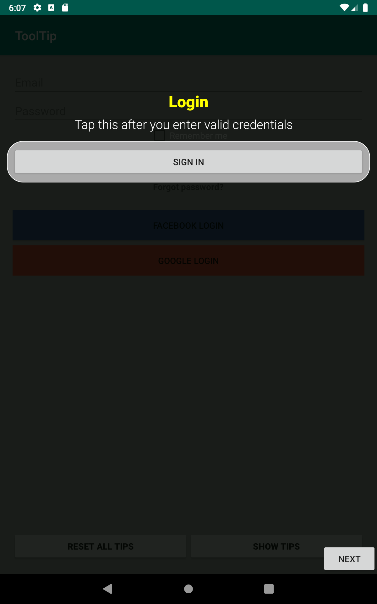
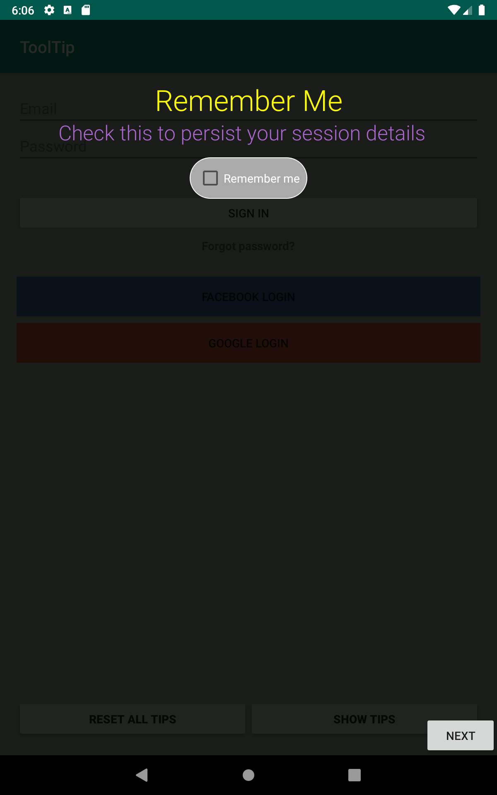
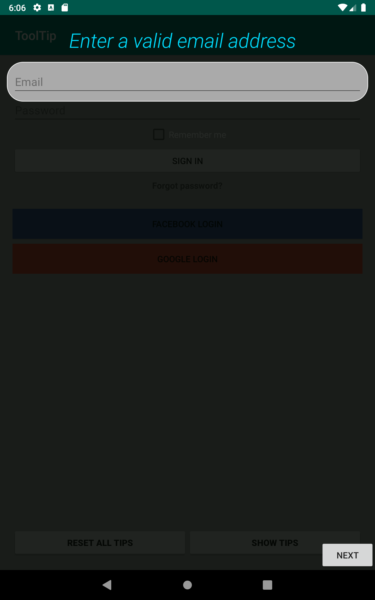
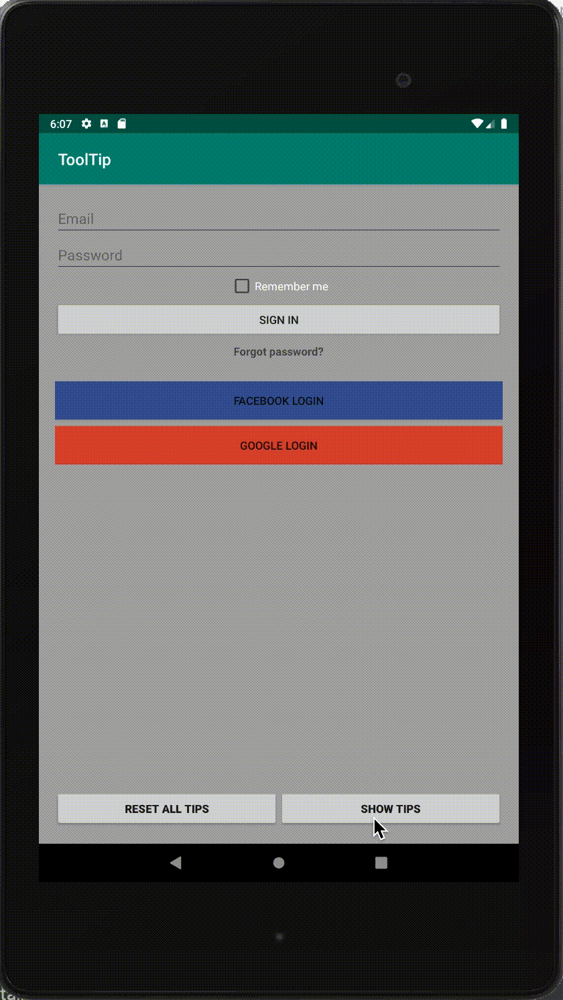

# ToolTipView For android
ToolTipView is a simple tooltip/intro/showcase library for Android

# Screenshots
Default view with optional title             |  Fully customizable |  Individual customization
:-------------------------:|:-------------------------:|:-------------------------:
  |   |  

# Demo 



# How this differs from other intro libraries?
With other libraries, you have to create the showcase cards yourself from each individual activities. But with this library, you just have inject the tips and all the target view's id at once. 

# Usage
## Initiate
### Using json data (Refer the Sample json data section for the format)
```java
ToolTipComposer.Builder tipComposerBuilder = new ToolTipComposer.Builder();
try {
    tipComposerBuilder.addStaticTip(tipDataInJsonFormat);
} catch (JSONException e) {
    e.printStackTrace();
}
ToolTipManager.init(this, tipComposerBuilder.build());
```

### By manually
```java
ToolTipComposer.Builder tipComposerBuilder = new ToolTipComposer.Builder();
String[] identifiers = new String[]{"helloWorldLabel", String.valueOf(R.id.empName), "designation"};
String[] tips = new String[]{"Tips for hello world", "Name of the logged in employee", "Role of the employee in the company"};
tipComposerBuilder.addStaticTips("MainActivity", identifiers, tips, null);
ToolTipManager.init(this, tipComposerBuilder.build());
```

### Adding tips individually
```java
ToolTipComposer.Builder tipComposerBuilder = new ToolTipComposer.Builder();
tipComposerBuilder.addStaticTip(LoginActivity.class.getSimpleName(), String.valueOf(R.id.checkboxRemember), "Remember me", "Check this box to store the session details." )
ToolTipManager.init(this, tipComposerBuilder.build());
```

## Customize the appearance of the tips
```java
ToolTipConfig globalConfig = new ToolTipConfig();
globalConfig.setTipMessageStyleResId(R.style.tipTextStyleGlobal);
globalConfig.setTipTitleStyleResId(R.style.tipTitleTextStyleGlobal);
tipComposerBuilder.setGlobalConfig(globalConfig);
```

## Customize the appearance of a individual tip
```java
@Override
public ToolTipConfig configForTip(ToolTip tip) {
    if (tip.getResourceId() == R.id.etEmail) {
        // to show home individual tips can be customized
        ToolTipConfig config = new ToolTipConfig();
        config.setTipMessageStyleResId(R.style.emailTipTextStyle);
        return config;
    }
    return null;
}
```

# Sample json data of tips
```json
{
  "MainActivity": [    
    {
      "id": "empName",
      "message": "Name of the logged in employee"
    },
    {
      "id": "designation",
      "message": "Role of the employee in the company"
    }
  ],
  "LoginActivity": [
    {
      "id": "etEmail",
      "message": "Enter a valid email address"
    },
    {
      "id": "etPassword",
      "title": "Password",
      "message": "Password should contain atleast 8 characters long"
    },
    {
      "id": "checkboxRemember",
      "title": "Remember Me",
      "message": "Check this to persist your session details"
    }
  ]
}
```
